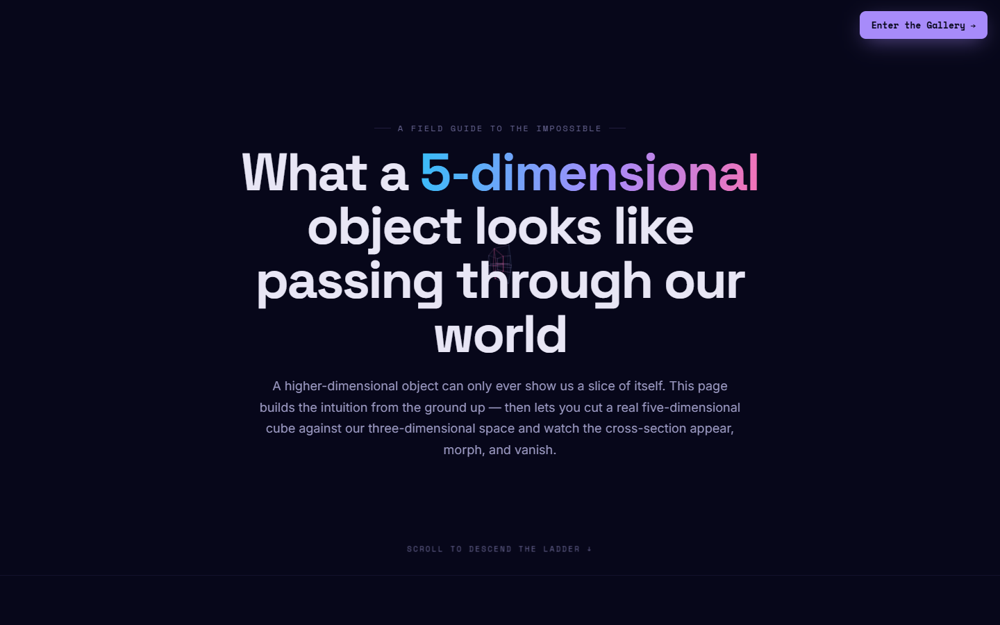
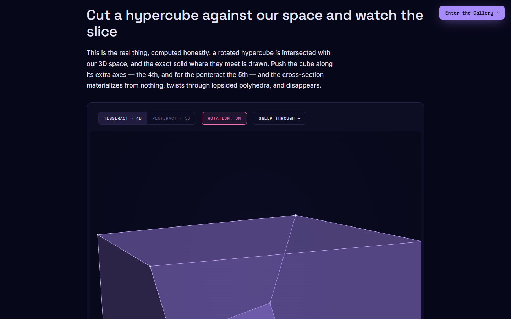
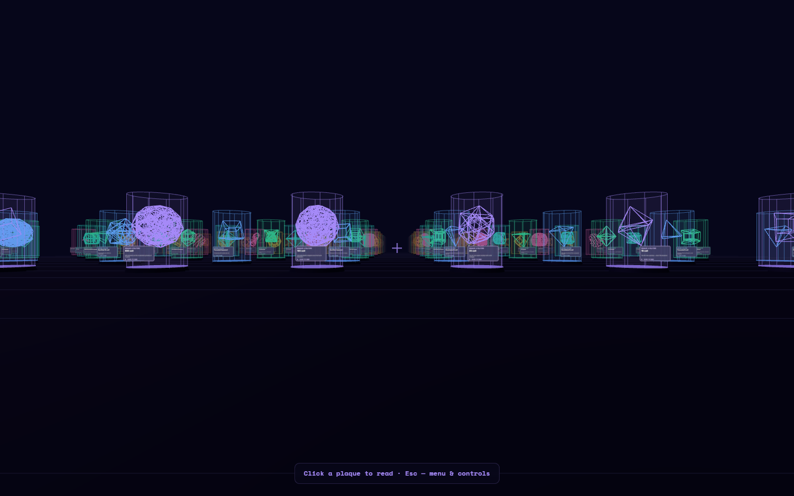

# Hyperspace

A single-page field guide to what a five-dimensional object would look like passing through our world: interactive hypercube slices and projections, then a walkable 3D gallery of 100 higher-dimensional exhibits.

   



Try it: [mindattic.com/hyperspace](https://mindattic.com/hyperspace/)

## Why

- Build real intuition for higher dimensions by climbing down before climbing up: a flat creature watching a sphere pass through its plane, then us watching a 4D and 5D cube pass through ours.
- See the actual cross-section, computed rather than faked: a rotated hypercube is intersected with 3D space and the exact solid is drawn.
- Watch a penteract's 32 vertices and 80 edges crowd into our space, and toggle its ten independent planes of rotation.
- Walk through 100 higher-dimensional objects in a 3D gallery, each with a plaque to read.
- Open one file in any browser: no build, no install, no account.
- Reuse the same 100 shapes anywhere: they live in a standard shape library in [MindAttic.UiUx](https://github.com/mindattic/MindAttic.UiUx), which the Cyberspace backdrop's Hyperspace Reader also draws from.

## Features

- Hero animation and a "ladder" that steps from 2D to 5D.
- Slice explorer: choose a tesseract (4D) or penteract (5D), turn rotation on or off, sweep the cube through our space, and drag sliders for the offset along the 4th and 5th axes. A readout shows the vertex and face count of the current cross-section and whether the object is present at all.
- Projection explorer: cube, tesseract or penteract wireframes cast into 3D, with chips for each plane of rotation.
- What you would actually witness: six short accounts (it blinks in from nowhere, morphs two ways at once, passes through itself, knots fall open, there is no inside, it never settles).
- The Hyperspace Gallery: a 10 x 10 hall of 100 exhibits, from the 5-cell, tesseract, 24-cell, 120-cell and 600-cell to prisms, duoprisms, curved manifolds, aperiodic order and 24-dimensional sphere packing. Each exhibit has a plaque with notes and references.
- Desktop controls with pointer lock, touch controls with two virtual sticks, a pause menu, and a boot progress bar while the gallery loads.





## Quick start

Open the live page, or run it locally from a clone. Any static server works; this one uses Python:

```bash
git clone https://github.com/mindattic/Hyperspace.git
cd Hyperspace
python -m http.server 8000
```

Then open `http://localhost:8000/index.htm`. You should see the landing screen above; scroll down for the explorers, or click Enter the Gallery.

Opening `index.htm` straight from disk also works. The shapes load from the CDN; if that file cannot be fetched (offline, or the pinned UiUx tag is not published yet), the page loads them from a sibling checkout at `../MindAttic.UiUx/Components/Hyperspace/hyperspace.js`, so clone MindAttic.UiUx next to this repo for offline development.

Gallery controls:

| Input | Action |
| --- | --- |
| W, A, S, D | Move |
| Shift | Sprint |
| Mouse | Look |
| Click | Read a plaque |
| Esc | Menu |
| Touch | Left stick moves, right stick looks |

## How it works

```text
index.htm  (the only file in this repo: HTML, CSS and JavaScript)
  |-- Field guide: hero canvas, slice explorer, projection explorer, witness notes
  |-- Gallery: Three.js scene, pointer-lock controls (inlined), touch sticks
  |-- hyperspace.js from MindAttic.UiUx@V12 on jsDelivr (fallback: ../MindAttic.UiUx/...)
  |     `-- window.Hyperspace: the 100 exhibits as data (id, geometry generator, rotation planes,
  |         plaque facts, article, references) plus pure nD rotation and projection
  `-- three.min.js 0.160.0 from jsDelivr; Google Fonts (Space Grotesk, Space Mono, Inter)
```

The page keeps the engine: the explorers' cross-section maths, the Three.js hall, the controls and the
article modal. The shapes are the [Hyperspace component](https://github.com/mindattic/MindAttic.UiUx/blob/main/Components/Hyperspace/Hyperspace.md)
of MindAttic.UiUx. The gallery takes each exhibit from `Hyperspace.shapes` (in order, 10 per row), gets
its wireframe from `Hyperspace.geometry(id)`, its cage-fitting scale from `Hyperspace.extent(id)` and each
frame's pose from `Hyperspace.pose(id, t)`; the explorers take their n-cubes from `Hyperspace.gen.nCube`
and project with `Hyperspace.projectDown`. To change a shape, its facts or its article, edit
`hyperspace.js` in MindAttic.UiUx, publish a new tag and repin it here.

## Deployment

The page is published at [mindattic.com/hyperspace](https://mindattic.com/hyperspace/). `index.htm` is the whole site; there is no build step. It pins the shape library to MindAttic.UiUx tag `V12`, which serves once that tag is published; until then the deployed page cannot load its shapes, so publish the tag before deploying this page.

Hyperspace is part of the MindAttic.Web family of sites built on MindAttic.UiUx (the family is still being planned).

## Documentation

- [AGENTS.md](AGENTS.md): instructions for AI agents working in this repo
- [Hyperspace component](https://github.com/mindattic/MindAttic.UiUx/blob/main/Components/Hyperspace/Hyperspace.md): the shape library's schema and API, and the Hyperspace Reader
- Tests: `tests/specs/components/hyperspace.spec.mjs` in MindAttic.UiUx opens this page from disk and checks that the explorers draw and the gallery boots, from the pinned CDN file and from the local fallback

## License

This repo has no LICENSE file. All rights reserved.

Part of [MindAttic](https://mindattic.com) — see more projects at [github.com/mindattic](https://github.com/mindattic).
