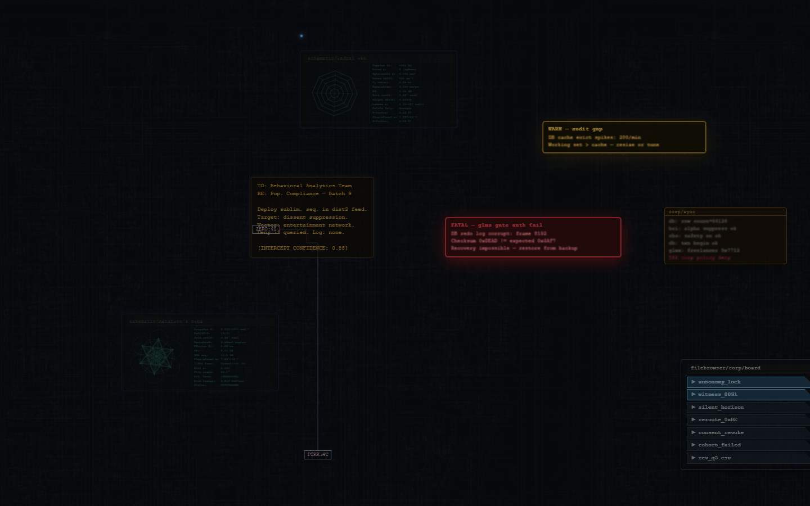
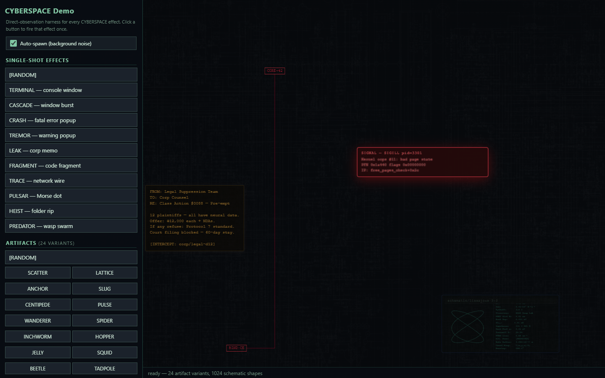
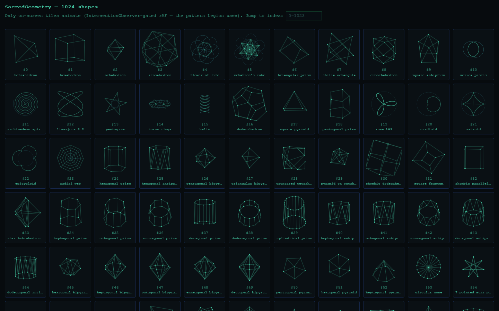

# MindAttic.UiUx

Shared front-end assets for every MindAttic site: a cyberpunk console-background engine, 1024 animated line-art shapes, fonts and UI widgets, served from jsDelivr by immutable tag with no build step.

[](Components/Cyberspace/console-bg.js) [](Components) [](CHANGELOG.md) [](tests/README.md) [](docs/BIBLE.md)



Try it: the backdrop behind the wordmark on [mindattic.com](https://mindattic.com) is this engine, loaded from `cdn.jsdelivr.net/gh/mindattic/MindAttic.UiUx@V10`.

## Why

- Load one pinned URL and get the same bytes forever: tags are immutable, so browsers and the CDN edge cache them indefinitely.
- Ship a living, animated backdrop with three divs, one stylesheet and two scripts, and no npm install on your side.
- Keep fonts, logos and theme art in one place instead of copying them into every site.
- Take a single component without dragging in the rest: each folder is self-contained, with no cross-component imports.
- Splice components into hand-authored files without merge fights: only the text between marker comments is ever rewritten.
- Know a release is sound before it ships: a Playwright suite checks the package and the three sites that load it.

## Features

### Components

Thirteen components live under `Components/`, each with its source files, a usage `.html` snippet, a `FolderName.md` doc (Textbox is documented in its CSS header) and any companion `.json` config. The catalog is also tracked as data in `docs/data/components.json`.

| Component | Type | What it does |
|---|---|---|
| [Cyberspace](Components/Cyberspace/Cyberspace.md) | HTML + CSS + JS bundle | Cyberpunk console-background engine: 12 named effects (TERMINAL, CRASH, TREMOR, LEAK, SCHEMATIC, CASCADE, ARTIFACT with 24 variants, FRAGMENT, TRACE, PULSAR, HEIST, PREDATOR), scan-line overlay, parallax circuit-board, keepout zones around content. SCHEMATIC draws its shapes from SacredGeometry. |
| [SacredGeometry](Components/SacredGeometry/SacredGeometry.md) | JS (UMD) + SVG | 1024 unique, animatable line-art shapes (polyhedra, parametric curves, knots, fractals). One renderer targets a live canvas or a static SVG string; `build-previews.mjs` emits a poster per shape and doubles as a smoke test. |
| [OutfitFont](Components/OutfitFont/OutfitFont.md) | font + CSS | Outfit variable font (weights 100 to 900) inlined as base64 woff2, Latin and Latin-Extended, plus a `--font-outfit` token. |
| [AtticFont](Components/AtticFont/AtticFont.md) | font + CSS | Attic display face inlined as base64 woff2 with a `--font-attic` token. Per-subscriber `applyToSelector` controls where it is auto-applied. |
| [PinFooter](Components/PinFooter/PinFooter.md) | CSS + JS | Pins any `.pin-when-short` element to the bottom while the document is shorter than the viewport; releases it when content overflows. |
| [BackHomeM](Components/BackHomeM/BackHomeM.md) | CSS only | A capital M in AtticFont pinned upper-left, linking back to mindattic.com. |
| [WebSnapshot](Components/WebSnapshot/WebSnapshot.md) | Node CLI + browser viewer | Captures a screenshot of any URL with Playwright, cover-fits and crops it, and inlines it as a data URI in a `.web-snapshot` container. |
| [PageScrollbar](Components/PageScrollbar/PageScrollbar.md) | CSS + JS + optional Razor | Themed, draggable overlay scrollbar with no dependencies. The native bar is hidden only once the script adds `.ma-sb-active`, so no-JS clients keep it. Optional Blazor wrapper. |
| [Textbox](Components/Textbox/textbox.css) | CSS only | Material-style outlined text field whose label floats into a notch in the top border on focus or when filled. Theme-able via CSS variables. |
| [Tooltip](Components/Tooltip/Tooltip.md) | CSS + JS + optional Razor | Accessible tooltip driven by a `data-tooltip` attribute, one reused floating node, optional Blazor wrapper. |
| [UserLogin](Components/UserLogin/UserLogin.md) | CSS + JS + Razor | Styling wrapper around the MindAttic.Authentication static-SSR login form. Does not implement authentication itself. |
| [UserCircle](Components/UserCircle/UserCircle.md) | CSS + JS + Razor | Authenticated-only avatar or initials circle, upper right; opens a menu or signs out via a native form with an antiforgery token. |
| [UserTimeout](Components/UserTimeout/UserTimeout.md) | CSS + JS + Razor | 30-minute idle warning with a countdown modal and auto-logout; arms only when authenticated; static-SSR safe. |

UserLogin, UserCircle and UserTimeout are the auth-visual trio, spliced into Tutor today.



The Cyberspace test harness (`Components/Cyberspace/index.htm`) forces any effect on demand.



The SacredGeometry QA grid (`Components/SacredGeometry/index.htm`) shows every shape in the catalog.

### Shared runtime asset package

Besides components, this repo is the one asset package every MindAttic site loads from jsDelivr: fonts, brand art, theme art and the Cyberspace textures, organised by domain. `assets-manifest.json` lists every served file (60 today) with its size, SHA-256 and pixel dimensions, and is regenerated by `tools/build-asset-manifest.ps1`. See [docs/ASSETS.md](docs/ASSETS.md) for the layout, naming and quality rules.

Today three sites load from the package, all pinned to the same tag by MindAttic.Deploy's linked deploy: mindattic.com, ryandebraal.com and mindatticcares.com.

### Themes

`Themes/` composes components into a ready-to-use bundle:

| Theme | Composes |
|---|---|
| [Cyberspace](Themes/Cyberspace/Cyberspace.md) | `theme.css` (page chrome: hero, readme, buttons, layout), `body-prelude.html` (the three fixed-position effect divs) and the Cyberspace, OutfitFont, AtticFont and BackHomeM components declared in `deps.json` |

None of the three sites loads it today; it is served for any page that wants the composition.

## Quick start

Add the Cyberspace backdrop to any page, pinned to a release tag.

1. Paste the three layers from `Components/Cyberspace/frontpage.html` at the top of `body`.
2. Add the stylesheet and scripts from jsDelivr:

```html
<link rel="stylesheet" href="https://cdn.jsdelivr.net/gh/mindattic/MindAttic.UiUx@V10/Components/Cyberspace/frontpage.css">
<script src="https://cdn.jsdelivr.net/gh/mindattic/MindAttic.UiUx@V10/Components/SacredGeometry/sacred-geometry.js" defer></script>
<script src="https://cdn.jsdelivr.net/gh/mindattic/MindAttic.UiUx@V10/Components/Cyberspace/console-bg.js" defer></script>
```

Open the page: console windows, fragments and schematics start spawning in the margins around your content. [Components/Cyberspace/Cyberspace.md](Components/Cyberspace/Cyberspace.md) covers the optional `loader.js`, `tv-static.js` and `home-bg.js` scripts.

To try it locally without a page of your own, serve the repo and open the harness:

```powershell
python -m http.server 8080
# then open http://localhost:8080/Components/Cyberspace/index.htm
```

## How it works

```text
              MindAttic.UiUx (this repo)
   Components/  Themes/  fonts/  <domain>/  assets-manifest.json
        |                   |                        |
        | git tag V<n>      | sync/*.ps1             | .github/workflows/
        v                   v                        v sync-subscribers.yml
   jsDelivr CDN        splice between           cross-repo PRs with
   @V<n> immutable     BEGIN/END markers        refreshed marker blocks
        |                   |                        |
        v                   v                        v
   mindattic.com       mindattic.com            mindattic/mindattic.com
   ryandebraal.com     MindAttic.Psst legal     mindattic/MindAttic.Psst
   mindatticcares.com  Tutor (Blazor wwwroot)
```

Three delivery modes read the same source: the CDN at runtime, PowerShell splices for local working copies, and a GitHub Action that opens PRs. This repo does not deploy anything itself and owns no hosting.

## Delivery pipelines

Full walkthrough, including the one-time PAT setup, in [.github/PIPELINES.md](.github/PIPELINES.md).

| Pipeline | What it does | When it runs |
|---|---|---|
| jsDelivr CDN | Serves any file at `https://cdn.jsdelivr.net/gh/mindattic/MindAttic.UiUx@REF/PATH`. REF is a whole-number tag (immutable), `main` (tracks tip of tree, about 7-day cache) or a commit SHA. | Continuously. Consumed by mindattic.com, ryandebraal.com and mindatticcares.com. |
| GitHub Actions cross-repo sync | `.github/workflows/sync-subscribers.yml` opens PRs against mindattic/mindattic.com (CYBERSPACE block) and mindattic/MindAttic.Psst (OUTFITFONT block). | On push to main touching `Components/Cyberspace`, `Components/OutfitFont`, `subscribers.json`, `sync/` or the workflow; skipped when the commit message contains `[skip ci]`. |
| PowerShell sync scripts | Local fallback with the same logic as the Action, run against your working copies; retired subscribers are skipped. MindAttic.Deploy runs `sync-mindattic-com.ps1` as a preDeploy hook for mindattic.com, passing the release tag. | Manually, or from MindAttic.Deploy. |

### Tagging a release

Tags are whole numbers (`V1`, `V2`, ...), never SemVer, and a published tag never moves. [CHANGELOG.md](CHANGELOG.md) lists what each contains.

For the linked group (this repo plus mindattic.com, ryandebraal.com and mindatticcares.com) you normally do not tag by hand. MindAttic.Deploy's linked deploy (`npm run deploy -- --uiux`) tags the next `V<n>` when HEAD is ahead of the latest tag, rewrites the pins in the three sites, verifies every asset on jsDelivr and then uploads the sites. `sync-mindattic-com.ps1` takes `-CyberspaceCdnTag`, which defaults to the latest `V*` tag in this repo, and the linked deploy passes the release tag explicitly.

To tag by hand:

```bash
git tag -a V10 -m "..."
git push origin main V10
# jsDelivr serves the new tag immediately; purge a branch ref if needed:
# GET https://purge.jsdelivr.net/gh/mindattic/MindAttic.UiUx@main/Components/Cyberspace/console-bg.js
```

### Why the two biggest Cyberspace scripts are CDN-loaded on mindattic.com

`console-bg.js` is about 580 KB and `sacred-geometry.js` about 60 KB. `sync-mindattic-com.ps1` keeps the small Cyberspace scripts (`loader.js`, `tv-static.js`, `home-bg.js`) and a circuit-board texture override inline, but emits those two as external jsDelivr script tags so the browser caches them across page loads. Both carry `defer`, so they download in parallel with parsing and never block first paint, and still run in document order: the inline block defines `window.__cyberspaceCircuitboardSrcs`, then `sacred-geometry.js` defines `window.SacredGeometry`, then `console-bg.js` reads both. The three parallax textures are preloaded at low priority.

### GitHub Action PAT

The cross-repo sync workflow needs a fine-grained personal access token, stored as the repository secret `SUBSCRIBER_REPO_TOKEN` under Settings, Secrets and variables, Actions. Generate it at [github.com/settings/personal-access-tokens/new](https://github.com/settings/personal-access-tokens/new):

| Field | Value |
|---|---|
| Resource owner | mindattic |
| Repository access | All repositories owned by mindattic |
| Expiration | About 1 year (rotate on calendar) |
| Permission: Metadata | Read-only (auto-included) |
| Permission: Contents | Read and write (push the auto/sync-components branch) |
| Permission: Pull requests | Read and write (open or update the cross-repo PR) |

Leave every other permission unchecked. Never paste the token into the repo, chat or a commit message; if you do, revoke it and generate a new one.

The same token is mirrored into the MindAttic.Vault token store under the GitHub bucket:

```csharp
using MindAttic.Vault.Credentials;

var pat = TokenStore.ForBucket("GitHub").Get("mindattic-uiux-pat");
```

The GitHub secret and the Vault entry are independent copies; rotating the token means updating both.

## Subscribers and sync

The canonical map is [subscribers.json](subscribers.json). It has two sections:

- `components`: every shippable component with its `type`, marker name and source-file paths (`cssFile`, `jsonFile`, `htmlFile`, `jsFiles`, `assetsDir`).
- `subscribers`: one entry per spliced property, each declaring `kind`, `target`, `syncScript` and a `subscriptions` array of `{ component, ...overrides }`.

| Subscriber | Kind | Target | Sync script | Subscriptions |
|---|---|---|---|---|
| mindattic.com | html-inline | mindattic.com/index.htm | sync-mindattic-com.ps1 | Cyberspace (fonts and logo load from the CDN) |
| MindAttic.Psst.Legal | html-inline-multi | MindAttic.Psst terms.htm and privacy.htm | sync-mindattic-psst.ps1 | OutfitFont |
| Tutor | blazor-wwwroot | Tutor/Tutor.Blazor | sync-tutor.ps1 | UserLogin, UserCircle, UserTimeout |
| Prose.Writer (retired) | blazor-wwwroot | does not exist | sync-prose.ps1 | OutfitFont, AtticFont, Cyberspace, PinFooter, UserLogin, UserCircle, UserTimeout |
| Prose.Codex (retired) | blazor-wwwroot | does not exist | sync-prose.ps1 | same as Prose.Writer |
| Ideas (retired) | blazor-wwwroot | does not exist | sync-ideas.ps1 | UserLogin, UserCircle, UserTimeout |

ryandebraal.com and mindatticcares.com are not spliced; they reference the package by jsDelivr URL only.

### How a sync script works

Every `sync-*.ps1` dot-sources `sync/_subscribers.ps1`, which supplies:

- `Get-Subscriber` and `Get-ComponentDescriptor` to read the two sections of `subscribers.json`.
- `Build-FontCssBody` to assemble a font component's CSS plus its `applyToSelector` rule (subscription override, then component default, then no rule).
- `Get-DominantEol` and `ConvertTo-Eol` so a splice keeps the host file's CRLF or LF convention.

Each script then does the same idempotent splice:

1. Read the subscriber's target files.
2. For each entry in its `subscriptions`, dispatch on the component to a builder (a `switch` in the script; a new component type needs a new case).
3. Replace everything between that component's BEGIN and END marker comments with the freshly built block. Everything outside the markers is left alone.
4. Write the file back with its original line endings.

Running a script twice with no source change produces a byte-identical file.

Retired subscribers are not deleted: they carry a `retired` field explaining why and how to re-enroll, and their script prints it and exits 0 (via `Test-SubscriberRetired`), so `sync-all.ps1` stays green.

### Marker contract

HTML subscribers use `<!-- BEGIN MINDATTIC.UIUX:MARKER -->` and a matching END comment; CSS subscribers use `/* == BEGIN MINDATTIC.UIUX:MARKER.CSS == */` and a matching END comment. The generated body opens with a "Generated by" comment warning not to hand-edit, because the next sync overwrites it.

### Enrolling a subscriber in a component

Add or remove one line in that subscriber's `subscriptions` array:

```json
"Tutor": {
  "kind":       "blazor-wwwroot",
  "target":     "D:/Projects/MindAttic/Tutor/Tutor.Blazor",
  "syncScript": "sync-tutor.ps1",
  "subscriptions": [
    { "component": "UserLogin" },
    { "component": "UserCircle" },
    { "component": "UserTimeout" }
  ]
}
```

The next sync enrolls or unenrolls automatically, unless the component's type has no dispatch case in that script yet; then add a builder function and `switch` case first.

| Subscriber kind | What adding a subscription means |
|---|---|
| html-inline (mindattic.com) | Edit `subscribers.json` if the type already has a case in `sync-mindattic-com.ps1`. The HTML marker pair must already exist once in `index.htm`. |
| blazor-wwwroot (Tutor) | Edit `subscribers.json` if the type already has a case in the sync script. CSS marker pairs in `app.css` are one-time hand inserts. |
| html-inline-multi (MindAttic.Psst legal) | Same as html-inline, but `target` is a folder and `targets` lists the files. |

## Building

There is no build step for consumers. To vendor one component or theme without the CDN, `build.ps1` copies its folder verbatim (to `dist/<Name>/`, git-ignored, unless `-Out` is given):

```powershell
powershell -File build.ps1 -Build OutfitFont
powershell -File build.ps1 -Build Cyberspace -Kind Theme -Out out/cyberspace-theme
```

`Cyberspace` is both a component and a theme, so it needs `-Kind Component` or `-Kind Theme`. Tests: `Invoke-Pester -Path tests/pester` (Pester 5+).

Run every splice locally, or one target:

```powershell
powershell -File sync/sync-all.ps1
powershell -File sync/sync-mindattic-com.ps1
powershell -File sync/sync-mindattic-psst.ps1
powershell -File sync/sync-tutor.ps1
```

`sync-all.ps1` discovers every `sync-*.ps1` by glob and aggregates failures. Downstream copies are derived artifacts; never edit between their markers.

Regenerate the asset manifest after adding or replacing a served file (`-Verify` fails if it is stale):

```powershell
powershell -File tools/build-asset-manifest.ps1
```

## Testing

`tests/` holds a Playwright Test suite that proves the package is complete and well formed (fonts and images decode, nothing re-encoded, manifest exact) and that the three sites load with no failed requests or console errors, talk only to allowed hosts, pin the expected tag and keep their layout across a viewport matrix. It drives the installed Google Chrome.

```powershell
cd tests
npm ci
npm test                # local mode: CDN requests answered from this working tree
npm run test:live       # real sites and real CDN
npm run test:assets     # package checks only, no browser
```

[tests/README.md](tests/README.md) lists every script and environment variable. SacredGeometry's `build-previews.mjs` also acts as a smoke test by regenerating its 1024 posters.

## Editing a component

Edit the files in the component's folder, then either push to main (the Action delivers to its subscriber jobs) or run `sync/sync-all.ps1` locally. To ship to the CDN-loaded sites, run MindAttic.Deploy's linked deploy, which tags a new release and repins all three sites.

## Adding a new component

1. Create a folder under `Components/` with its source files and a `FolderName.md` doc.
2. Register it in `subscribers.json` under `components` with its `type`, source paths and a base marker name.
3. Add `{ "component": "Name" }` to each subscriber that should receive it.
4. In each subscribed project, insert the marker pair once by hand, and add a builder and `switch` case to the sync script if the type is new.
5. Run `sync/sync-all.ps1` and confirm a clean splice.
6. Add the component to `docs/data/components.json` (schema in `docs/data/_schema/component.schema.json`).

## Adding a new subscriber

Add a splice-in-place subscriber only when it has hand-authored content interleaved with the components, like `mindattic.com/index.htm` or the MindAttic.Psst legal pages. A page that only needs assets should load them from jsDelivr instead.

1. Add an entry under `subscribers` with `kind`, `target`, `syncScript` and `subscriptions`.
2. Create `sync/sync-NAME.ps1` that dot-sources `_subscribers.ps1`, reads its entry with `Get-Subscriber` and iterates its subscriptions.
3. Make it idempotent: two runs with no source change produce no diff.
4. `sync-all.ps1` picks it up automatically.
5. For GitHub Action delivery, add a job following `.github/workflows/sync-subscribers.yml`.

## Keepout zones

`console-bg.js` keeps effects from spawning behind page content. The placer weights overlap with keepout rects four times a normal window overlap, so it strongly prefers the margins. Built-in selectors:

- `.cyberspace-keepout`, an opt-in marker for any container.
- `main`.
- `.home-content`.
- `.board-grid`.

Hosts can add more at runtime:

```js
window.__cyberspaceKeepoutSelectors = '.foo, .bar';
```

## Cyberspace effect catalog

Names and definitions live in the registry header of `console-bg.js`. Toggles (`FX_` flags) and spawn rates (`RATE_` constants) sit near the top of the file; set a toggle to `false` to turn an effect off.

| Name | Spawn function | Toggle and rate | What it does |
|---|---|---|---|
| TERMINAL | spawnWindow | FX_WIN, remainder | Generic console window, the workhorse |
| CRASH | spawnError | FX_ERROR, 1% | Fatal-error popup |
| TREMOR | spawnWarning | FX_WARN, 1% | Warning popup |
| LEAK | spawnMemo | FX_MEMO, 4% | Leaked corporate memo, erased character by character |
| SCHEMATIC | spawnGeoWindow | FX_GEO, 10% | Geometric schematic window with a SacredGeometry shape |
| CASCADE | spawnCascade | FX_CASCADE, 3% | Burst of 3 to 6 cascaded console windows |
| ARTIFACT | spawnArtifact | FX_ARTIFACT, 12% | Floating glyph cluster, 24 variants |
| FRAGMENT | spawnFrag | FX_FRAG, 40% | Floating code fragments, the most frequent effect |
| TRACE | spawnNetConnect | FX_NET, 8% | Tron-cycle network wire route |
| PULSAR | spawnMorseDot | FX_MORSE, 5% | Morse-code glowing dot |
| HEIST | spawnFolderRip | FX_FOLDER, 4% | Folder-rip file-extraction sequence |
| PREDATOR | spawnArtifactPredator | FX_PREDATOR, 1.2% | Rare artifact-hunting swarm |

ARTIFACT rolls one of 24 variants per spawn (`ART_VARIANTS`): SCATTER, LATTICE, ANCHOR, SLUG, CENTIPEDE, PULSE, WANDERER, SPIDER, INCHWORM, HOPPER, JELLY, SQUID, BEETLE, TADPOLE, ANT, MOIRE, VORTEX, EXPLOSION, ORBIT, NETWORK, PHASEFIELD, SHATTER, SPIROGRAM and PULSARRING. The original seven:

| Variant | Behaviour |
|---|---|
| SCATTER | Random blob; all glyphs drift one direction |
| LATTICE | Fibonacci grid; the whole lattice drifts with a corner-wave delay |
| ANCHOR | Stationary grid; glitches in place and emits feelers |
| SLUG | Single grid crawls with per-cell undulation |
| CENTIPEDE | Multi-segment chain with a peristaltic wave and leader feelers |
| PULSE | Concentric Fibonacci rings with a lub-dub heartbeat |
| WANDERER | Small grid walks the screen and pauses to look around |

The registry header in `console-bg.js` describes the other seventeen.

| Effect | Sub-behaviours |
|---|---|
| PULSAR | BLINK (about 90%, classic on/off pulse); SHIFT (about 10%, slides in cardinal directions and color-swaps each symbol) |
| TRACE | ARC (spark burst at about 30% of sharp turns); ACK (three-blink success then synced fade); SEVER (direction-aligned CONNECTION-LOST message on failure) |
| HEIST | HIGHLIGHT (cyan glow on a run of files); EXTRACT (slide-right exit with shimmer and per-file stagger); DISSOLVE (window fades when extraction completes) |
| PREDATOR | STALK (off-screen swarm homes on prey); SCAN (prey detection cone); FLEE (prey redirects away); DEVOUR (cell adopts a wasp glyph then dissolves); DISPERSE (wasps scatter and fade) |

## Project layout

```text
MindAttic.UiUx/
  Components/            13 self-contained components (table above)
    Cyberspace/          frontpage.html/.css, console-bg.js, home-bg.js, tv-static.js,
                         loader.js, index.htm (test harness), assets/ (parallax PNGs)
    SacredGeometry/      sacred-geometry.js (UMD), build-previews.mjs, previews/, index.htm (QA grid)
    ...                  OutfitFont, AtticFont, PinFooter, BackHomeM, WebSnapshot, PageScrollbar,
                         Textbox, Tooltip, UserLogin, UserCircle, UserTimeout
  Themes/Cyberspace/     theme.css, body-prelude.html, deps.json
  fonts/                 outfit/ and attic/ woff2 web fonts
  mindattic.com/         logos/
  mindatticcares.com/    icons/, images/, logos/
  ryandebraal.com/       themes/<name>/, images/
  archive/               kept but not served: font sources, brand masters, unused art
  assets-manifest.json   generated list of every served file
  tests/                 Playwright suite for the package and the three sites; pester/ for build.ps1
  sync/                  _subscribers.ps1 helper, sync-all.ps1, one sync-*.ps1 per subscriber, sync.md
  docs/                  BIBLE, AMENDMENTS, USER_STORIES, ASSETS, data/, images/
  tools/                 codex.ps1, build-asset-manifest.ps1, build-readme.ps1
  subscribers.json       components registry and subscriber map
  build.ps1              standalone vendoring build (copies one component/theme folder)
  .github/               PIPELINES.md and workflows/sync-subscribers.yml
```

## Documentation

- [docs/BIBLE.md](docs/BIBLE.md): what the system is and is not, architecture, the laws (MAU-LAW-1 to 7).
- [docs/AMENDMENTS.md](docs/AMENDMENTS.md): pending decisions not yet folded into the bible (normally empty).
- [docs/USER-STORIES](docs/USER_STORIES.md): stories with test and evidence citations.
- [docs/ASSETS.md](docs/ASSETS.md): the runtime asset package.
- [docs/data/components.json](docs/data/components.json): the component catalog as data.
- [CHANGELOG.md](CHANGELOG.md): what each release tag contains.
- [sync/sync.md](sync/sync.md) and [.github/PIPELINES.md](.github/PIPELINES.md): sync and pipeline details.
- [AGENTS.md](AGENTS.md) and [CLAUDE.md](CLAUDE.md): working rules for coding agents.

Run `powershell -File tools/codex.ps1 doctor` after editing anything under `docs/`, and `powershell -NoProfile -ExecutionPolicy Bypass -File tools\build-readme.ps1` after editing this README.

## License

This repo has no LICENSE file. All rights reserved. OutfitFont bundles the Outfit typeface from Google Fonts.

Part of [MindAttic](https://mindattic.com) — see more projects at [github.com/mindattic](https://github.com/mindattic). Related: [MindAttic.Deploy](https://github.com/mindattic/MindAttic.Deploy), [mindattic.com](https://github.com/mindattic/mindattic.com).
