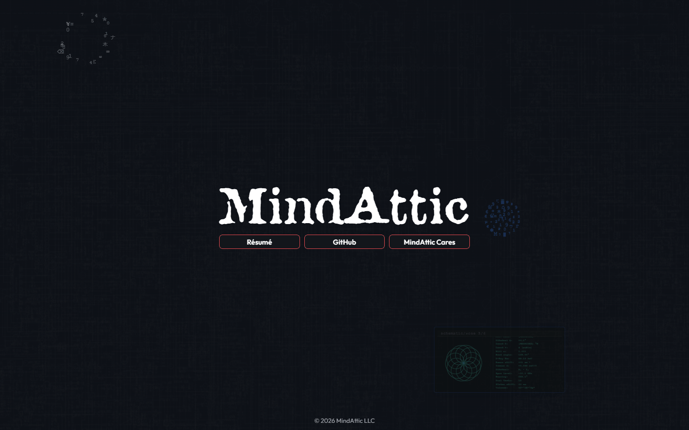

# mindattic.com

Ryan DeBraal's front door: one hand-authored HTML page with the MindAttic wordmark, three links and a tap-to-play Cyberspace backdrop, with no build step, no framework and no tracking.

[](index.htm) [](index.htm) [](index.htm) [](https://github.com/mindattic/MindAttic.Web/tree/main/MindAttic.Web.Shared) [](https://mindattic.com)


Try it: [mindattic.com](https://mindattic.com)

## Why

- One click from the MindAttic name to the résumé, the GitHub organisation or the charity, with nothing in the way.
- The page is the same shape on every screen. Every length is a multiple of one viewport unit, so a phone and an ultrawide monitor see the same composition.
- View Source is meant to be read. The file opens with an ASCII banner and a numbered table of contents, so it reads like a conversation, not a puzzle.
- Nothing to install and nothing to build. The file you edit is the file the browser runs.
- No analytics, no tracking pixels and no third-party fonts. The only outside host is a tag-pinned CDN copy of MindAttic's own asset package.

## Features

| Piece | What it is |
|---|---|
| `#site-name` | The "MindAttic" wordmark, set in the Attic display font |
| `.link-row` and `.link-btn` | Three equal-width buttons: Résumé (`https://ryandebraal.com`), GitHub (`https://github.com/mindattic`) and MindAttic Cares (`https://mindatticcares.com`). Each opens in a new window, which screen readers announce through `aria-describedby` |
| `.lockup` | The wordmark and buttons, centred both ways. The three buttons together are exactly as wide as the wordmark |
| `#site-footer` | Copyright line fixed to the bottom edge. The page never scrolls |
| No selection | Text can't be highlighted (`user-select: none`), long-press shows no iOS copy bubble and taps don't flash a highlight box. Links and keyboard focus still work |
| Cyberspace block | The backdrop (circuit-board parallax, scanlines, console windows), spliced in by the MindAttic.Web.Shared sync |
| Tap script | Tap or left-click anywhere around the lockup: a quiet glow-and-ring tap hint and one random Cyberspace effect (any of the 13, including a Hyperspace Reader scanner window) start right there (kept on screen and clear of the lockup). Taps on the lockup or within 16px of it, on a link, or with the right or middle button do nothing. With reduced motion requested the hint is just the glow, stationary |
| Link preview | Meta description, canonical URL, `theme-color` and Open Graph / Twitter card tags, so shared links show the M monogram and a one-line summary |

Everything on the page is a multiple of one viewport-relative unit (`--u`, 1% of the smaller visible viewport side), so it keeps the same shape on every screen and aspect ratio.



The file opens with an ASCII banner and a numbered table of contents, from § 1 to § 12, aimed at anyone who opens View Source (see [BIBLE §2](docs/BIBLE.md#MAC-§2) and [LAW-7](docs/BIBLE.md#MAC-LAW-7)).

## Quick start

You need Python 3 (or any static file server) and a network connection, because fonts, logo, effects engine and textures load from jsDelivr.

```powershell
git clone https://github.com/mindattic/MindAttic.Web
cd MindAttic.Web\mindattic.com
python -m http.server 3457
start http://localhost:3457/index.htm
```

You should see the wordmark and three buttons over the dark Cyberspace backdrop. Tap the background to set off a quiet tap hint and an effect at that spot. The `/run` Claude Code skill does the same thing.

The page fetches no local data, so opening `index.htm` directly works too.

## Stack

`HTML5`, `CSS3` (custom properties, `dvmin`-based sizing, dark "Cyberspace" palette only, see [LAW-5](docs/BIBLE.md#MAC-LAW-5)), one small vanilla JavaScript snippet, and the shared Cyberspace bundle from `MindAttic.Web.Shared`.

No React. No Vite. No npm. No analytics, tracking pixels or third-party fonts. The only external host is `cdn.jsdelivr.net`, serving the `MindAttic.Web.Shared` repo ([LAW-6](docs/BIBLE.md#MAC-LAW-6)).

## Where the assets live

The assets are not in this folder and not in the HTML. Fonts (Outfit, Attic), the logo PNGs, the Cyberspace effects engine and its parallax textures are plain static files in `MindAttic.Web.Shared`, the shared package folder next to this one in the [MindAttic.Web](https://github.com/mindattic/MindAttic.Web) monorepo, served over jsDelivr at a tag-pinned URL:

```text
https://cdn.jsdelivr.net/gh/mindattic/MindAttic.Web@V<n>/MindAttic.Web.Shared/<path>
```

`<head>` opens the connection early (`preconnect`) and preloads the first-paint fonts. The two big engine scripts are `defer`red so they never block the first paint.

Release tags on MindAttic.Web are immutable whole numbers (`V12`, `V13`, and so on). The page pins the release tag the linked deploy sets: the deploy rewrites every `MindAttic.Web@V…/MindAttic.Web.Shared/` URL in `index.htm` to that tag, and passes the same tag to the sync script's `-CyberspaceCdnTag` for the Cyberspace block (run by hand, the script defaults to the latest `V*` tag in the MindAttic.Web checkout). Never point the page at `@main`.

Layout of the package (full rules in `MindAttic.Web.Shared/docs/ASSETS.md`):

- Shared fonts at the package root: `fonts/outfit/`, `fonts/attic/`.
- Site-specific files directly under the domain folder as `<domain>/<category>/` (this site: `mindattic.com/logos/`).
- Cyberspace textures at `Components/Cyberspace/assets/`.
- Filenames are lowercase kebab-case.

## Project layout

```text
mindattic.com/
├── index.htm                  # The entire homepage: wordmark, three buttons, backdrop
├── idiotproof/                # Support pages for the IdiotProof project (see below), deployed
│   ├── privacy-policy.htm     # Standalone privacy policy, deployed to /idiotproof/
│   ├── terms-of-use.htm       # Standalone terms of use, deployed to /idiotproof/
│   ├── dataset/               # ML feature-store exports (trades.csv, bars.csv, manifest.json)
│   └── replays/               # Generated trade-replay HTML archive: gitignored, deploy-only
├── docs/                      # Codex canon: BIBLE, AMENDMENTS, USER_STORIES, images/
├── tools/
│   ├── codex.ps1              # doctor (validate docs/) and digest (regenerate BIBLE.digest.md)
│   └── build-readme.ps1       # Thin wrapper -> shared engine in ../../codex-standard/build-readme.ps1
├── .claude/                   # Slash commands (/deploy, /quicksave, /quickload), skills
│                              #   (/run, /commit, /discard, /revert), hooks (digest injection,
│                              #   quickload-on-do)
├── .prose/                    # Provider-neutral aliases of the same commands
└── README.md                  # This file
```

This folder sits in the [MindAttic.Web](https://github.com/mindattic/MindAttic.Web) monorepo next to `MindAttic.Web.Shared`, `ryandebraal.com`, `mindatticcares.com` and `Hyperspace`. It has no deploy script and no FTP settings. Deployment lives in the sibling MindAttic.Deploy repo (see [Deployment](#deployment)).

## Editing the page

The only region you must not hand-edit is the `BEGIN/END MINDATTIC.UIUX:CYBERSPACE` block: the next MindAttic.Web.Shared sync overwrites it ([LAW-2](docs/BIBLE.md#MAC-LAW-2)).

### Change a link or the wordmark

Edit the three `<a class="link-btn">` anchors (or the `<h1 id="site-name">`) near the end of `index.htm`. Keep `target="_blank" rel="noopener noreferrer"` on the links. The layout adapts on its own: the buttons are equal width and span exactly the wordmark's width.

### Take a new asset release

Add or change the file in `MindAttic.Web.Shared`, commit it, then run the linked deploy (see [Deployment](#deployment)): it tags the next whole-number release, rewrites every pin in `index.htm` to it, re-runs the Cyberspace sync with that tag and checks every URL is live on jsDelivr before anything is uploaded. Do not hand-edit the tag numbers.

### Cyberspace, the only synced component

The sync is not run on its own from this folder. It happens during a deploy, through `MindAttic.Web.Shared/sync/sync-mindattic-com.ps1` (in the same monorepo), which rewrites only the `CYBERSPACE` marker block. Cyberspace is the only MindAttic.Web.Shared component this site subscribes to: the fonts and logo load straight from the CDN.

## The idiotproof folder

[IdiotProof](https://github.com/mindattic/IdiotProof) is one of the `MindAttic.*` ecosystem software projects: a tool that connects to a brokerage account (Alpaca) to author and evaluate trading strategies and, optionally, place orders. Its project page is its GitHub README.

What does live in this folder, under `idiotproof/`, is the small set of static support pages that ship to `/idiotproof/` on the same domain:

| Path | What it is | Tracked in git |
|---|---|---|
| `idiotproof/privacy-policy.htm` | Standalone privacy policy page | Yes |
| `idiotproof/terms-of-use.htm` | Standalone terms-of-use page | Yes |
| `idiotproof/dataset/manifest.json`, `trades.csv`, `bars.csv` | Exported ML feature-store data (one row per round-trip trade, one row per minute bar), generated by IdiotProof's own SQL export and checked in | Yes |
| `idiotproof/replays/**` | A generated archive of trade-strategy replays (an `index.htm` per ticker plus one per replay run), grouped by trading day | No: gitignored, it exists only to be uploaded |

These are plain static files with their own inline `<style>` and `<script>`. They are uploaded by the `idiotproof-replays` site entry in `MindAttic.Deploy/projects.json` (`uploadDir`, source `../MindAttic.Web/mindattic.com/idiotproof`), separately from `index.htm`. IdiotProof writes the replay archive straight into this folder.

## Deployment

Use the `/deploy` Claude Code slash command, or run:

```powershell
cd D:\Projects\MindAttic\MindAttic.Deploy
npm run deploy -- --site mindattic.com
```

The pipeline is owned entirely by the sibling MindAttic.Deploy repo ([LAW-4](docs/BIBLE.md#MAC-LAW-4)).

It is a linked deploy: the shared package and all four sites live in one git repo, MindAttic.Web, so deploying this site also publishes `MindAttic.Web.Shared` and deploys `ryandebraal.com`, `mindatticcares.com` and `Hyperspace` (see `MindAttic.Deploy/README.md`, "Linked deploy"):

1. Preflight: MindAttic.Web must be clean, on `main` and not behind origin, with a current asset manifest.
2. Works out the next whole-number tag (`V<n>`).
3. Rewrites the pins in every site page to that tag, runs this site's hook `sync-mindattic-com.ps1 -CyberspaceCdnTag <tag>` to splice the Cyberspace block, and stamps the `Last Updated` comment at the top of each page.
4. Commits those changes as "Pin MindAttic.Web.Shared V<n>", tags that commit, and pushes `main` and the tag.
5. Verifies every asset the sites use is live on jsDelivr at that tag, byte-exact, before anything is uploaded.
6. FTPS-uploads the sites in order: `ryandebraal.com`, `mindatticcares.com`, `Hyperspace` (to `/mindattic.com/hyperspace/`), then this site's `index.htm` to `/mindattic.com/`.

If `HEAD` already carries the latest tag and the pins match it, that tag is reused and nothing is committed. `--dry-run` previews without changing anything; `--no-link` deploys this site alone.

Only `index.htm` is uploaded. The fonts, logo, engine and textures are already on the CDN (they ship when the tag is pushed).

This site's deploy profile lives in `MindAttic.Deploy/projects.json` under `sites[]`. FTP credentials are centralised in MindAttic.Deploy (gitignored there).

A `PostToolUse` hook in `.claude/settings.json` also stamps the `Last Updated` comment locally on every `Edit` or `Write` of `index.htm`, independent of a deploy.

## Hosting

The server holds static files only. Its `/mindattic.com/` folder is the docroot: `index.htm` and `idiotproof/` from this folder, `hyperspace/` from the `Hyperspace` folder of MindAttic.Web (all uploaded by MindAttic.Deploy), and a hand-placed `.htaccess` that is not in the repo. That `.htaccess` forces HTTPS, redirects `www.mindattic.com` to `mindattic.com`, and 301-redirects project URLs of the form `/<slug>.htm` to the matching GitHub repo, so each project's page is its GitHub README. Details: [BIBLE §4.4](docs/BIBLE.md#MAC-§4.4).

## Conventions

- Asset URLs: `https://cdn.jsdelivr.net/gh/mindattic/MindAttic.Web@V<n>/MindAttic.Web.Shared/<path>`, tag-pinned, whole-number tags, never `@main`.
- Asset layout in `MindAttic.Web.Shared`: shared fonts at the root (`fonts/<family>/`), per-site files at `<domain>/<category>/` (no `assets/` level), kebab-case filenames, variant last (`m-monogram-transparent.png`).
- Page CSS: IDs for singletons (`#content`, `#site-name`, `#site-footer`); classes for reusable pieces (`.lockup`, `.link-row`, `.link-btn`); sizing chain `--u` to `--wm` to `--btn-u`; lengths in `rem` or `dvmin`, or multiples of those variables.

The full list is [BIBLE §10](docs/BIBLE.md#MAC-§10).

## Testing

There is no compiler or unit-test suite in this folder: it is a static HTML page. "Verified" here means the file loads as HTML, the page's markup is present as documented, and `codex doctor` passes clean. The shared Playwright suite in `MindAttic.Web.Shared/tests` (same monorepo; `npm run test:local` there) loads this page in Chrome and covers the linked sites.

```powershell
powershell -NoProfile -ExecutionPolicy Bypass -File tools\codex.ps1 doctor   # validate docs/
powershell -NoProfile -ExecutionPolicy Bypass -File tools\codex.ps1 digest   # regenerate the digest
powershell -NoProfile -ExecutionPolicy Bypass -File tools\build-readme.ps1   # regenerate README.htm
```

## Documentation

This folder follows the MindAttic Codex documentation standard (project code MAC). A fact lives in exactly one layer:

| Layer | File | What it holds |
|---|---|---|
| L0 | [docs/BIBLE.md](docs/BIBLE.md) | What the site is and is not, architecture, hosting, the Laws (`MAC-LAW-n`), verified state, glossary, conventions |
| L1 | [docs/AMENDMENTS.md](docs/AMENDMENTS.md) | Decisions not yet folded into the bible (normally empty) |
| L2 | [docs/USER_STORIES.md](docs/USER_STORIES.md) | Stories `MAC-US-<Epic><n>`; every done story cites its evidence |
| rfc | `docs/rfc/` | Open design notes, when there are any |
| generated | [docs/BIBLE.digest.md](docs/BIBLE.digest.md) | Produced by `tools/codex.ps1 digest`; never hand-edited |

Agent instructions: [AGENTS.md](AGENTS.md) is this project's agent entrypoint. `CLAUDE.md` is a provider forwarder to the workspace-wide MindAttic agent standard.

## License

This folder has no LICENSE file. All rights reserved.

---

Part of [MindAttic](https://mindattic.com) — see more projects at [github.com/mindattic](https://github.com/mindattic). Lives in [MindAttic.Web](https://github.com/mindattic/MindAttic.Web) with [ryandebraal.com](https://github.com/mindattic/MindAttic.Web/tree/main/ryandebraal.com), [mindatticcares.com](https://github.com/mindattic/MindAttic.Web/tree/main/mindatticcares.com), [Hyperspace](https://github.com/mindattic/MindAttic.Web/tree/main/Hyperspace) and [MindAttic.Web.Shared](https://github.com/mindattic/MindAttic.Web/tree/main/MindAttic.Web.Shared). Deployed by [MindAttic.Deploy](https://github.com/mindattic/MindAttic.Deploy).
